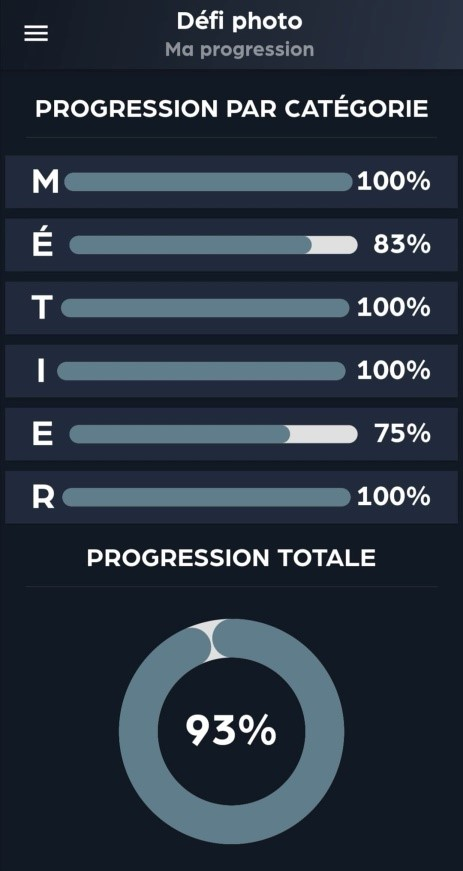
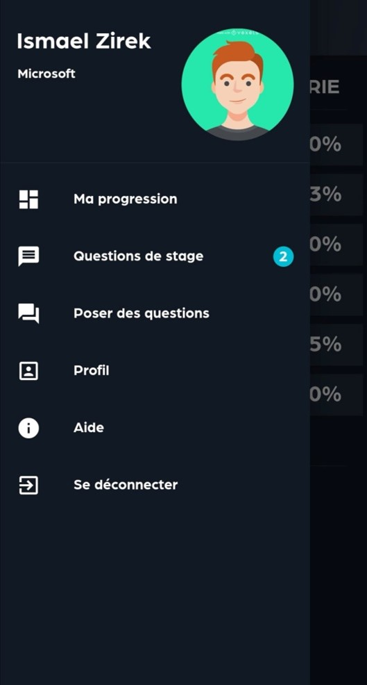
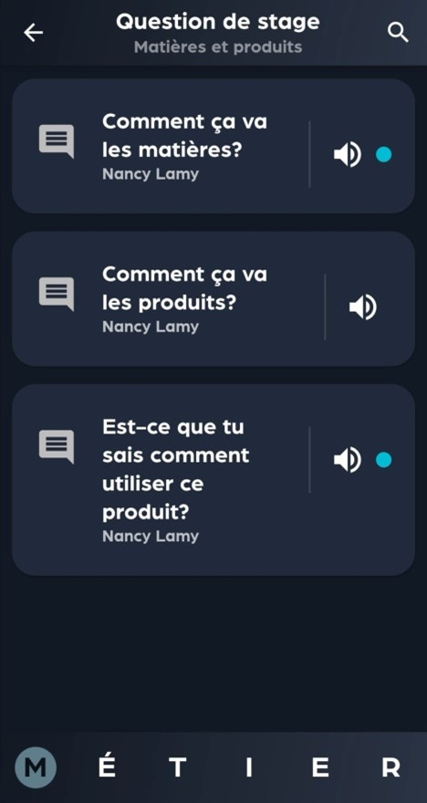
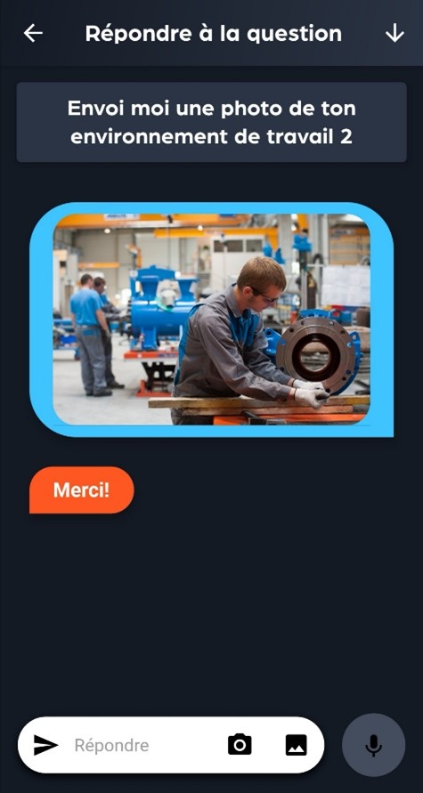
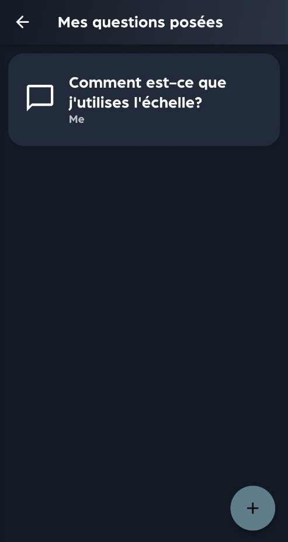
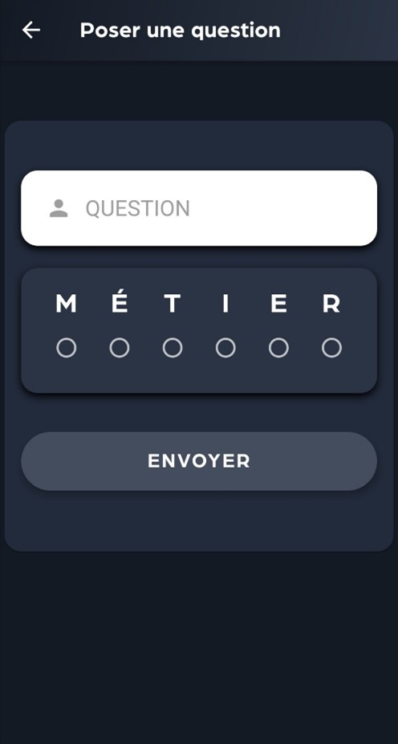
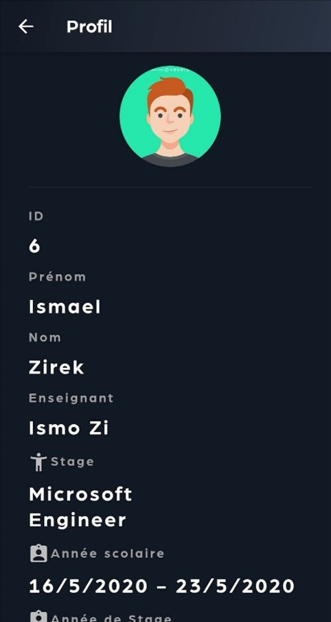
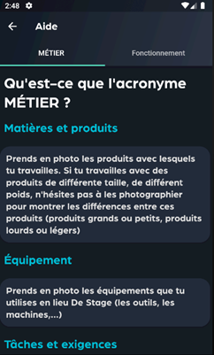

# Défi photo
Ce projet a été effectué en collaboration avec la Commission scolaire de la Pointe de l’île. Cette application permettra aux enseignants et enseignantes de cette Commission scolaire de faire un suivi avec leurs élèves lors de leur stage et ainsi évaluer leur progression dans leur milieu de travail.

## Cas d'utilisation

Dans un premier temps, l’utilisateur peut se connecter à l’application par l’intermédiaire de la page de connexion, il suffit simplement d’entrer son ID et son mot de passe. 

### Étudiant

Du côté de l’étudiant, sur sa page d’accueil, il peut voir sa progression sur chaque section. Cette page sera divisée en 6 catégories sous l’acronyme ‘’MÉTIER’’ : 
·         M : Matière et produits 
·         É : Équipements 
·         T : Tâches 
·          I : Individu 
·         E : Environnement 
·         R : Ressource humaine. 
Pour chaque catégorie, le stagiaire recevra des questions de son enseignant. 

En cliquant sur une question quelconque, il se dirigera vers une page de conversation qui lui permettra d’ajouter une réponse. Il devra répondre aux questions de son enseignant à l’aide des moyens suivants : 
·         Photos 
·         Messages vocaux 
·         Messages textes 
Il pourra ajouter une photo, en la choisissant de sa galerie ou bien en la prenant directement à partir de sa pellicule. Il pourra aussi envoyer un message vocal ou un message texte. Les multiples options de réponses permettent une communication plus fluide entre l’enseignant et l’élève. Ceci permettra donc à l’enseignant de superviser et faire un suivi détaillé sur les 6 catégories qui entourent le stage de l’élève. 
 
En cliquant sur le « Menu Hamburger » l’élève peut accéder à plusieurs fonctions, soit, aller à sa page d’accueil de progression, accéder à ses questions de stage, accéder à une page dans laquelle il pourra poser une question à son enseignant, voir son profil, se rendre vers la page d’aide ou bien se déconnecter.

### Enseignant

Pour sa part, l’enseignant pourra gérer les élèves de sa classe. Plus précisément, à la page d’accueil, l’enseignant peut voir la liste de tous les élèves. En appuyant sur la carte d’un stagiaire, cela permettra à l’enseignant d’accéder aux questions qu’il lui a déjà posées, et d’en poser d’autres s’il le désire. De plus, sur sa page d’accueil, l’enseignant peut accéder à la progression ou au profil d’un élève en appuyant sur l’icône correspondante. De plus, le professeur aura la possibilité de rechercher un étudiant dans la liste, en entrant simplement le nom ou le prénom de l’étudiant(e). En cliquant sur le « Menu Hamburger », l’enseignant pourra accéder à une page dans laquelle il pourra voir toutes les questions posées par ses différents élèves. Dans ce même menu, il pourra se déconnecter.

### Administateur

Finalement, l’administrateur a accès à tous les commentaires, questions et profils des élèves ainsi que celui des professeurs. Il a aussi la possibilité de créer de nouveaux comptes.

## Les classes de l'application

Flutter est un environnement de développement d’applications mobile qui utilise le langage Dart. Dans cet outil, tout ce qui fait partie de la vue de l’application est un “widget”. Si vous désirez visualiser toutes nos classes dans un diagramme UML, vous pourrez y accéder dans le dossier de remise de la documentation ou sur GitHub, le fichier se nomme diagrammeUML.png. 

De plus, tout au long du développement, nous avons réutilisé des classes en les modifiant avec des conditions « if » afin qu’elles se modifient selon le type d’utilisateur. C’est pour cette raison qu’on peut retrouver certaines classes dans plusieurs vues. Voici les principales classes de la vue de notre application :

•	Login : C’est la page principale de l’application. Elle permet aux utilisateurs de s’identifier et envoi ceux-ci à leur page principal selon leur rôle

•	mainPageEleve : C’est la page principale de l’élève, c’est dans cette page qu’il arrive lorsqu’il se connecte. Elle est aussi réutilisée par l’enseignant pour qu’il puisse voir la progression d’un élève en particulier dans sa liste.

•	mainPageProf : C’est la page principale de l'enseignant, c’est dans cette page qu’il arrive lorsqu’il se connecte.

•	mainPageAdmin : C’est la page principale de l’admin, c’est dans cette page qu’il arrive lorsqu’il se connecte.

•	pageCommentaire : C’est la page dans laquelle les élèves et les enseignants arrivent lorsqu’ils appuient sur une question. Cette page affiche tous les commentaires qui sont relié à la question en particulier. C’est aussi sur cette page que l’élève répondra aux questions de l’enseignant.

•	pageQuestion : C’est la page grâce à laquelle l’élève peut poser une question à son enseignant et vice-versa.

•	questionStage : C’est une page qui est commune aux enseignants et aux élèves. Pour l’élève, elle y affiche toutes les questions qui lui sont adressées. Pour l’enseignant, elle est affichée dans deux cas : 

1.	Pour y afficher les questions qu’il a posées à un élève en particulier.
2.	Pour afficher les questions qui lui ont été posées par des élèves.

•	pageAide : C’est une page d’aide destinée à l’étudiant.

•	profilEleve : C’est une page qui affiche les informations d’un étudiant. Elle est accessible par les élèves et les enseignants.

•	customDrawer : C’est un widget qui est présent autant dans la vue enseignant que la vue élève. Ce widget est le “menu hamburger” et c’est grâce à celui-ci que les utilisateurs peuvent accéder à toutes les pages. Il varie selon le rôle de l’utilisateur.

•	ajoutUtilisateur : C’est une page qui est seulement accessible par l’administrateur pour ajouter des nouveaux utilisateurs à la plateforme.

## Les différentes vues de l'étudiant

### Progression:
La page de progression est la première page que l’étudiant voit lorsqu’il se connecte sur l’application.
Cette page montre à l’étudiant sa progression pour chaque catégorie (M.E.T.I.E.R). Une barre de couleur augmente plus la note est haute. Le pourcentage total des questions répondues est disponible au bas de la page.

### Menu « Hamburger » :
Ce menu qui est disponible en haut à gauche de l’écran permet à l’élève de naviguer dans les différentes pages de l’application. En premier lieu, il peut accéder à ses questions de stage. Comme on peut le remarquer dans la photo, un petit rond bleu avec le chiffre deux est visible à côté de cette option, ce qui veut dire que l’élève a deux questions auxquelles il n’a pas répondu. Une fois que ces questions seront répondues, ce cercle disparaîtra. De plus, il peut naviguer vers une page pour poser des questions, vers son profil, vers la page d’aide ou il peut se déconnecter.

### Question de stage:
Cette fenêtre est la page où l’étudiant peut voir les questions posées par l’enseignant.
#### Questions de l’enseignant : 
Les questions du professeur sont affichées au milieu de l’écran. Il est possible de glisser l’écran s’il y a plusieurs questions.
#### Recherche : 
Il est possible de filtrer les questions pour retrouver celle nécessaire. 
#### Audio : 
Il est possible d'écouter les questions posées par l’enseignant grâce à la synthèse vocale. Cette option permet une communication plus fluide entre l’enseignant et certains élèves ayant de la difficulté à lire.
#### (M.É.T.I.E.R) : 
Le tableau de bord est divisé en 6 catégories sous l’acronyme « MÉTIER » :
#### Notification : 
Comme on peut le voir sur la photo, certaines questions ont un petit rond bleu à droite. Ceci veut dire que la question n’a pas encore été répondue. Une fois que l’élève y répondra, le rond bleu disparaîtra.

### Communication:
En appuyant sur une question de l’enseignant, l’élève peut répondre à la question. Chaque question a sa propre conversation pour faciliter la communication. Sur cette page, la question de l’enseignant est affichée au haut de l’écran.
Selon le type de question demandé par le professeur, l’élève pourra répondre aux questions à l’aide de messages textes, de messages vocaux et de photos.
Pour envoyer un message vocal, l’utilisateur doit appuyer sur le bouton de microphone. Lorsqu’activé, celui-ci deviendra rouge. Pour mettre fin au message, l’utilisateur doit appuyer une deuxième fois sur le bouton, celui-ci redeviendra gris et le message s’enverra

### Mes questions:
Cette fenêtre est la page où l’étudiant peut poser ses questions. L’élève peut voir la liste des questions qu’il a envoyée et en poser des nouvelles. En appuyant sur l’icône de « + », l’étudiant peut composer sa question. 

De plus, si l’enseignant a répondu à sa question, l’étudiant peut supprimer celle-ci en appuyant et maintenant la question de son choix, une fenêtre apparaîtra ensuite pour lui demander de confirmer son choix.

### Poser une question:
S’il veut poser une question, il devra l’écrire dans la case assignée à cette fin, et choisira la catégorie à laquelle la question correspond (Catégories venant de l’acronyme MÉTIER). 

### Page du profil:
Cette page montre les informations de l’étudiant. Celui-ci peut voir son :
#### •	ID (Propre à chaque utilisateur) 
#### •	Prénom 
#### •	Nom
#### •	Enseignant
#### •	Stage (Domaine du stage)
#### •	Année scolaire en cours
#### •	Année de stage
#### •	Courriel

Sur cette page, l’élève peut aussi choisir sa photo de profil en appuyant sur l’avatar au fond vert. Toutefois, cette photo est seulement là pour permettre à l’élève de personnaliser son application. Ainsi, elle est seulement stocker en local, elle n’est pas visible par son enseignant et elle s’efface lors de la déconnexion de l’élève.

### Page d’aide:
L’étudiant peut accéder à la page d’aide s’il a besoin de plus d’information. Il peut se renseigner sur l’acronyme (M.É.T.I.E.R) ainsi que le fonctionnement de l’application.
Sur la page « MÉTIER », il y a des informations additionnelles sur chaque catégorie.
Sur la page « Fonctionnement », l’étudiant peut facilement apprendre à utiliser les différentes fonctionnalités implantées dans l’application.

